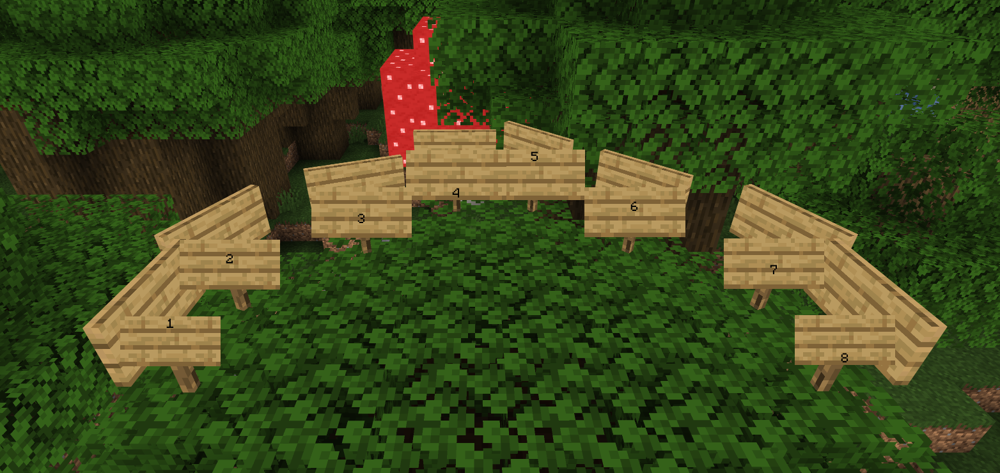

# BlueMap Sign Extractor

Displays signs on your [BlueMap](https://github.com/BlueMap-Minecraft/BlueMap) as markers!

This is a Native BlueMap Addon, so it should be compatible with
all platforms and all versions that BlueMap supports, including the CLI!\
Just put the `.jar` file in BlueMap's `packs/` directory, and it should work out of the box.

To reload this addon, just reload BlueMap itself with `/bluemap reload`.

## [Click here to download!](../../releases/latest)

## Support

To get support with this addon, join the [BlueMap Discord server](https://bluecolo.red/map-discord)
and ask your questions in [#3rd-party-support](https://discord.com/channels/665868367416131594/863844716047106068).
You're welcome to ping me, @TechnicJelle.
